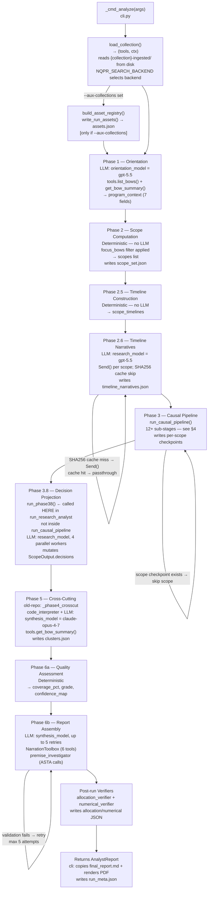

# ARCHITECTURE — LangGraph-Native NQPR Pipeline

Design document for the LangGraph-native rewrite of the NQPR (quarterly portfolio review) system.

**Scope:** Precheck through Finalize — the vector store and collection artifacts (`{program}-ingested/`) are assumed to exist on disk before the pipeline runs. Ingestion (the old `collect` step) is out of scope.

**Reference:** `CODEBASE_AUDIT.md` §15 for all data-field definitions.

---

## Table of Contents

1. [WorkflowState TypedDict](#1-workflowstate-typeddict)
2. [Top-Level Graph Topology](#2-top-level-graph-topology)
2a. [Analyze Pipeline — Entry Point, End-to-End Flow, and Data Flow](#2a-analyze-pipeline--entry-point-end-to-end-flow-and-data-flow)
3. [Analyze Subgraph — 8 Named Phases (LangGraph Design)](#3-analyze-subgraph--8-named-phases-langgraph-design)
4. [Causal Pipeline Subgraph — 12+ Sub-Stages](#4-causal-pipeline-subgraph--12-sub-stages)
5. [Research Dispatch Subgraph — Stage 4](#5-research-dispatch-subgraph--stage-4)
6. [Async Node Function Signatures](#6-async-node-function-signatures)
7. [Persistence Strategy](#7-persistence-strategy)
8. [Human-in-the-Loop Points](#8-human-in-the-loop-points)
9. [CLI → LangGraph Mapping](#9-cli--langgraph-mapping)
10. [Tools Inventory](#10-tools-inventory)
11. [Search Backend Abstraction](#11-search-backend-abstraction)
12. [Send() Usage Summary](#12-send-usage-summary)
13. [Out-of-Scope Graphs — evidence_audit and gs_verifier](#13-out-of-scope-graphs--evidence_audit-and-gs_verifier)
14. [Python Dependencies](#14-python-dependencies)
15. [Observability](#15-observability)

---

## 1. WorkflowState TypedDict

The pipeline reads pre-existing collection artifacts from disk; it does not produce them. Fields that describe the on-disk collection (doc_list, scoring, etc.) are read at startup and treated as immutable inputs. Fields that describe pipeline outputs (analyst_report, scope_outputs, etc.) are `None` until the stage that writes them completes.

Fan-out collectors use `Annotated[list, operator.add]` reducers so parallel `Send()` branches merge correctly.

All `*_traces` fields also use `Annotated[list[dict], operator.add]` reducers. Workers append a single trace dict per call. Traces capture metadata only — not full result content — sufficient to reconstruct provenance and support audit. Initialise all trace fields to `[]` in `create_initial_state()`.

> **Implementation note:** `from __future__ import annotations` must be the **first executable line** in `state.py` (after the module docstring if present), before all other imports. Python evaluates `TypedDict` field annotations at class-definition time in 3.9–3.11; without the future import, forward references and `Annotated[...]` expressions inside `TypedDict` bodies raise `NameError` at import time.

```python
from __future__ import annotations

import operator
from pathlib import Path
from typing import Annotated, Any, Optional, TypedDict


# ── Sub-state slices sent via Send() ──────────────────────────────────────────

class InvestmentRubricState(TypedDict):
    """Sent per-investment into evaluate_investment_rubric (Stage 3.1)."""
    inv_id: str
    scope_id: str
    timeline: dict                   # serialised InvestmentTimeline
    result: Optional[dict]           # InvestmentEvidencePack — filled by worker


class LinkInvestigationState(TypedDict):
    """Sent per-causal-link into investigate_link (Stage 3.4)."""
    link_id: str
    inv_id: str
    bow_id: str
    scope_id: str
    claim: dict                      # serialised InvestigationClaim
    model: str
    result: Optional[dict]           # LinkAssessment — filled by worker


class ScienceAssumptionState(TypedDict):
    """Sent per-science-assumption into investigate_science_assumption (Stage 3.5d)."""
    assumption_id: str
    inv_id: str
    bow_id: str
    scope_id: str
    question: str
    result: Optional[dict]           # ScienceInvestigationResult — filled by worker


class ResearchTaskState(TypedDict):
    """Sent per-research-task into the appropriate worker node (Stage 4)."""
    task_id: str
    task_type: str                   # "slr" | "lbd" | "deep_web" | "edison"
    query: str
    linked_scope: str
    priority: str                    # "critical" | "important" | "nice_to_have"
    result: Optional[dict]           # filled by worker


class ScopeDecisionState(TypedDict):
    """Sent per-scope into project_scope_decisions (Stage 3.8)."""
    scope_id: str
    scope_output: dict               # serialised ScopeOutput
    decisions: Optional[list[dict]]  # list[Decision] — filled by worker


# ── Top-level WorkflowState ───────────────────────────────────────────────────

class WorkflowState(TypedDict):
    """
    Single state object threaded through all pipeline stages.
    Collection artifacts (ingested_dir and below) are pre-existing inputs,
    read at pipeline startup. Pipeline outputs (analyst_report and below)
    are written by each stage.
    """

    # ── Run identity ──────────────────────────────────────────────────────────
    # All identity fields are also available in config["configurable"] for
    # any node that receives RunnableConfig (search tools, acall_llm wrappers).
    # Nodes should prefer state for long-lived data and config for transient
    # per-invocation context (search_backend, pages_dir, model names).
    program: str                         # e.g. "Malaria", "HIV"
    run_name: str                        # human-readable slug, e.g. "crimson-falcon"
    collection_name: str                 # alias used in search backend routing
    base_dir: str                        # path to ~/qpr-collections
    focus: Optional[str]                 # free-text focus area for analyze
    focus_bows: Optional[list[str]]      # restrict analysis to these BOW IDs
    aux_collections: Optional[list[str]] # cross-corpus collection names for asset fanout

    # ── Pre-existing collection inputs (read from {program}-ingested/) ────────
    # These are populated by the load_collection startup step and never mutated.
    ingested_dir: str                    # absolute path to {program}-ingested/
    doc_list: list[dict]                 # content of doc_list.json
    investment_scoring: dict             # {inv_id: InvestmentDetail} from investment_scoring.json
    bow_investment_map: dict             # {bow_id: [inv_id, ...]} from bow_investment_map.json
    investment_bow_rows: list[dict]      # from investment_bow_rows.json
    investment_intelligence: dict        # {inv_id: InvestmentIntelligence}
    chunks_json_path: str                # embedding_index/chunks.json
    pages_dir: str                       # pages/{file_id}/ tree root

    # ── Precheck gate ─────────────────────────────────────────────────────────
    precheck_passed: Optional[bool]
    precheck_report: Optional[str]       # formatted text for human review

    # ── Stage 2 outputs (under threads/) ─────────────────────────────────────
    threads_dir: Optional[str]
    final_report_md_path: Optional[str]  # human-readable deliverable — keep
    final_report_md: Optional[str]
    analyst_report: Optional[dict]       # serialised AnalystReport (in-state; no path)
    scope_outputs: Optional[list[dict]]  # list[ScopeOutput] (in-state; no path)
    excerpts_csv_path: Optional[str]     # human-readable CSV deliverable — keep
    numerical_provenance: Optional[list[dict]]
    verification_sources: Optional[list[dict]]
    run_meta: Optional[dict]
    trace_jsonl_path: Optional[str]      # observability trace — keep

    # Intermediate analyze state (subgraph-internal, checkpointed for resume)
    program_context: Optional[dict]      # structured orientation output (7 fields from Phase 1)
    scopes: Optional[list[dict]]         # list[Scope]
    scope_timelines: Optional[dict]      # {scope_id: ScopeTimeline}
    allocation_verification_path: Optional[str]   # human-readable — keep
    numerical_verification_path: Optional[str]    # human-readable — keep

    # Fan-out collector fields — written by Send() worker nodes
    # NOTE: evidence_packs / link_assessments / science_results / scope_decisions are
    # NOT forwarded from the causal subgraph back to WorkflowState. Their data is
    # embedded in scope_outputs by the collect_* reducer nodes inside the causal
    # subgraph. WorkflowState only accumulates research_results (Stage 4).
    evidence_packs: Annotated[list[dict], operator.add]      # InvestmentEvidencePack per inv
    link_assessments: Annotated[list[dict], operator.add]    # LinkAssessment per link
    science_results: Annotated[list[dict], operator.add]     # ScienceInvestigationResult per assumption
    scope_decisions: Annotated[list[dict], operator.add]     # Decision lists per scope
    all_excerpts: Annotated[list[dict], operator.add]        # citation excerpts for bibliography

    # Tool call traces (accumulated across all nodes)
    asta_traces: Annotated[list[dict], operator.add]
    slr_traces: Annotated[list[dict], operator.add]
    lbd_traces: Annotated[list[dict], operator.add]
    deep_web_traces: Annotated[list[dict], operator.add]
    edison_traces: Annotated[list[dict], operator.add]
    web_search_traces: Annotated[list[dict], operator.add]
    compute_traces: Annotated[list[dict], operator.add]
    collection_search_traces: Annotated[list[dict], operator.add]
    investigation_traces: Annotated[list[dict], operator.add]

    # ── Stage 3 outputs ───────────────────────────────────────────────────────
    research_plan: Optional[list[dict]]  # [{id, type, query, priority, linked_scope}]
    research_plan_md_path: Optional[str] # human-readable deliverable — keep
    research_plan_approved: Optional[bool]

    # ── Stage 4 outputs (under run_dir/research/) ─────────────────────────────
    research_dir: Optional[str]
    research_results: Annotated[list[dict], operator.add]    # per-task result dicts
    dispatch_results: Optional[list[dict]]   # in-state; no path
    edison_results: Optional[list[dict]]     # in-state; no path
    research_ok_count: Optional[int]

    # ── Stage 5 outputs ───────────────────────────────────────────────────────
    final_report_wresearch_md_path: Optional[str]
    final_report_wresearch_md: Optional[str]
    final_report_pdf_path: Optional[str]
    report_approved: Optional[bool]

    # ── Error / status ────────────────────────────────────────────────────────
    errors: Annotated[list[str], operator.add]
    current_stage: Optional[str]
```

---

## 2. Top-Level Graph Topology

### Nodes

| Node name | Role | Maps to CLI |
|---|---|---|
| `load_collection` | **True START node.** Reads `{program}-ingested/` from disk; populates all collection input fields in `WorkflowState`. Runs once, checkpointed, skipped on resume if fields already populated. | — |
| `precheck` | Fast integrity gate: validates pre-existing artifacts | `precheck` |
| `analyze` | Full research analyst — delegates to analyze subgraph | `analyze` |
| `prepare_research` | Build research plan from analyst findings | `prepare-research` |
| `review_research_plan` | **Human interrupt** — review and edit research_plan.md | — |
| `research` | Dispatch SLR / LBD / deep_web / Edison — delegates to research subgraph | `research` |
| `finalize` | Inject research results, rewrite report | `finalize` |
| `approve_report` | **Human interrupt** — approve before delivery | — |
| `deliver` | Terminal: copy final PDF/MD to delivery location | — |

### Edges

```
START
  │
  ▼
load_collection   ◄── reads {program}-ingested/; skipped on resume if already populated
  │
  ▼
precheck
  │
  ├──[precheck_passed=False]──► END   (fail fast; human must fix collection)
  │
  ▼
analyze  ◄── interrupt_before; human can cancel before expensive LLM run
  │
  ▼
prepare_research
  │
  ▼
review_research_plan  ◄── interrupt_before; human edits research_plan.md
  │
  ├──[research_plan_approved=False]──► prepare_research   (regenerate)
  │
  ▼
research  ◄── interrupt_before; human can prune tasks before dispatch
  │
  ▼
finalize
  │
  ▼
approve_report  ◄── interrupt_before; human reads final_report_wresearch.md
  │
  ├──[report_approved=False]──► finalize   (re-run enrichment)
  │
  ▼
deliver
  │
  ▼
END
```

### Conditional edge functions (synchronous)

```
route_after_precheck(state)              → "analyze" | END
route_after_research_plan_review(state)  → "research" | "prepare_research"
route_after_report_approval(state)       → "deliver" | "finalize"
```

### Entry point and terminal nodes

- **Entry:** `START → load_collection`
- **Terminal (success):** `deliver → END`
- **Terminal (precheck failure):** `precheck → END`

---

## 2a. Analyze Pipeline — Entry Point, End-to-End Flow, and Data Flow

This section documents the **old-repo** analyze pipeline as it runs today from `cli.py`, and maps each step to the LangGraph node that replaces it. Use this as the authoritative reference for control flow, data flow, collection-API search calls, branching, and termination when implementing the analyze subgraph.

### Entry Point — `_cmd_analyze` in `cli.py`

Invoked via `python -m src.qpr analyze --collection <name> [flags]`.

**CLI flags forwarded to `run_research_analyst`:**

| Flag | Parameter | Default |
|---|---|---|
| `--collection` | `collection_name` | required |
| `--base-dir` | `base_dir` | `~/qpr-collections` |
| `--output-dir` | `output_dir` | auto-generated |
| `--model` | `synthesis_model` | `SYNTHESIS_MODEL = "claude-opus-4-7"` |
| `--research-model` | `research_model` | `ANALYSIS_MODEL = "gpt-5.5"` |
| `--focus` | `focus` | None |
| `--focus-bows` | `focus_bows` | None |
| `--aux-collections` | `aux_collections` | None |

**`orientation_model` is NOT a CLI flag** — `run_research_analyst` accepts it as a keyword argument but the CLI never exposes or forwards it; it always uses its default `ANALYSIS_MODEL = "gpt-5.5"`.

**`_cmd_analyze` execution order:**

1. `_load_env()` — loads `.env` from working directory
2. `_setup_logging(verbose)` — configures log level
3. Sets `LLM_TRACE_FILE` env var → `{output_dir}/trace.jsonl` *(consumed by `llm_utils.call_llm` for full LLM call tracing)*
4. Resolves `output_dir` → `{base_dir}/{collection}-experiments/run-{auto-name}/` if not provided (`auto-name` from `generate_run_name()`)
5. **`load_collection(collection_name, base_dir, aux_collections)`** → `(CollectionTools tools, CollectionContext ctx)`
   - Reads `NQPR_SEARCH_BACKEND` env var to select backend (`local` / `qdrant` / `azure`)
   - Reads from `{base_dir}/{collection}-ingested/`: embedding index (`.npy` + `.sqlite`), `document_catalog.json`, `investment_scoring.json`, `bow_investment_map.json`, `investment_bow_rows.json`, `investment_intelligence.json`
   - For each name in `aux_collections`: tries `LocalSearchIndex` from `{base_dir}/{aux}-ingested/embedding_index/`, falls back to `AzureSearchIndex(team=aux, strict=False)`
6. If `aux_collections` provided: `build_asset_registry(...)` + `write_run_assets(...)` → writes `{output_dir}/assets.json`
7. **`run_research_analyst(tools, call_llm, research_model=..., synthesis_model=..., focus=..., focus_bows=..., cache_dir={output_dir}/threads/)`** → `AnalystReport`
8. Copy `threads/final_report.md` → `{output_dir}/final_report.md`
9. Conditionally `md_to_pdf(...)` → `{output_dir}/final_report.pdf`
10. Write `{output_dir}/run_meta.json`

---

### End-to-End Control Flow (Ordered)

Sequential phase order inside `run_research_analyst`. Phase numbers match old-repo source; LangGraph mapping is in §9.

**Phase 1 — Orientation**
- **Reads:** `tools.list_bows()`, `tools.get_bow_summary(bow_id)` (top-N BOWs), doc_list, investment_scoring, investment_intelligence
- **LLM call:** `orientation_model` (default `"gpt-5.5"`); produces `ProgramContext` with 7 fields: `theory_of_change`, `major_bets`, `stated_priorities`, `key_timelines`, `portfolio_health_signals`, `bow_summaries`, `initial_concerns`
- **Produces:** `program_context: dict`
- **Branching:** none

**Phase 2 — Scope Computation** *(deterministic, no LLM)*
- **Reads:** `program_context`, doc_list, `bow_investment_map`, `focus_bows` filter
- **Logic:** groups investments by BOW; filters by chunk-count threshold; applies `focus_bows` restriction when set
- **Produces:** `scopes: list[Scope]`
- **Side effects:** writes `threads/scope_set.json`, `threads/checkpoint_initial.json`
- **Branching:** `focus_bows` excludes non-matching BOWs; scopes with zero qualifying investments dropped

**Phase 2.5 — Timeline Construction** *(deterministic, no LLM)*
- **Reads:** `scopes`, doc_list, `investment_scoring`, `investment_intelligence`, `pages_dir`
- **Produces:** `scope_timelines: dict[scope_id, ScopeTimeline]`

**Phase 2.6 — Timeline Narratives** *(LLM, parallel per scope)*
- **Reads:** `scope_timelines`; checks `{ingested_dir}/timeline_narratives.json` cache (SHA256-keyed)
- **LLM call:** `research_model` (default `"gpt-5.5"`), one call per scope needing a narrative
- **Produces:** narrative strings merged into `scope_timelines`
- **Side effects:** writes/updates `{ingested_dir}/timeline_narratives.json`
- **Branching:** scopes with a matching SHA256 cache entry are skipped — conditional `Send()` fan-out or passthrough edge
- **Looping:** single LLM call per scope, no retry

**Phase 3 — Causal Pipeline** *(delegates to `run_causal_pipeline`; see §4 for all 12+ sub-stages)*
- **Reads:** `scopes`, `scope_timelines`, `tools`, `call_llm`, `program_context` (as `context`), `cache_dir`, `research_model`, `synthesis_model`
- **Produces:** `list[ScopeOutput]` — each carrying causal_model, evidence_packs, link_assessments, science_results, synthesis, critique, gaps, necessity scores, bow_context
- **Side effects:** per-scope checkpoint JSON files in `cache_dir`
- **Branching (scope-level):** per-scope checkpoint exists → scope skipped (resume path)
- **Looping:** see §4 sub-stage detail; investigation loops terminate on `status ∈ {answered, not_answerable, unresolved_conflict}` + empty `next_actions`, `max_iterations=40`, or 3 consecutive empty rounds

**Phase 3.8 — Decision Projection** *(called from `run_research_analyst`, NOT inside `run_causal_pipeline`)*
- **Reads:** `list[ScopeOutput]` returned by Phase 3
- **LLM call:** `research_model`, `concurrent.futures.ThreadPoolExecutor(max_workers=4)` (one call per scope in parallel)
- **Logic:** `_sanitize_candidate` → `_section1a_gate` → `_compute_rank_score` → `_apply_caps` (max 3 per INV, max 8 per scope); `_THIN_EVIDENCE_DECISION_TYPES = {"request_progress_packet", "validate_assumption"}` bypass the gate
- **Produces:** mutates `ScopeOutput.decisions` in place; returns total decision count
- **Branching:** `_sanitize_candidate` drops invalid structure; `_section1a_gate` drops low-confidence candidates not in thin-evidence types; `_apply_caps` drops lowest-ranked excess
- **LangGraph note:** in the new design this phase moves inside the causal subgraph as `dispatch_decision_projections → project_scope_decisions → collect_decisions` (§4)

**Phase 5 — Cross-Cutting Analysis** *(old-repo internal name: `_phase4_crosscut`)*
- **Reads:** `list[ScopeOutput]`, `AnalystReport` draft, `investment_scoring`
- **Pre-step:** `code_interpreter` call (OpenAI `ANALYSIS_MODEL = "gpt-5.5"`) → `portfolio_metrics` dict
- **Tool calls:** `tools.get_bow_summary(bow_id)` for cross-scope context
- **LLM call:** `synthesis_model` (default `"claude-opus-4-7"`); produces `CrossCuttingFindings` (patterns, contradictions, shared_dependencies, emergent_decisions, essay)
- **Side effects:** writes `threads/checkpoint_after_phase5_crosscut.json`; calls cluster identification LLM (shortlist high-severity deviations → group into 3–5 thematic clusters) → stores in `state.clusters` and `cross_cutting_analysis["clusters"]` (not written to disk — LangGraph state replaces `threads/clusters.json`)
- **Branching:** none

**Phase 6a — Quality Assessment** *(deterministic, no LLM)*
- **Reads:** `list[ScopeOutput]`
- **Produces:** `coverage_pct: float`, `grade: "A"|"B"|"C"|"D"`, `confidence_map: dict[scope_id, "high"|"medium"|"low"]`
- **Side effects:** writes `threads/checkpoint_after_phase6_quality.json`

**Phase 6b — Report Assembly** *(up to 5 retries on structure validation failure)*
- **Reads:** all scope_outputs, analyst_report, clusters, cross-cutting findings, investment_scoring, figures_dir
- **LLM calls:** multiple per section (`synthesis_model`); exec summary via `premise_investigator` (uses OpenTelemetry spans; calls `AstaClient` for science assessment)
- **Tool calls:** `NarrationToolbox` — `list_filtered_investments` + `search_within_scope` (3 queries) invoked by `_run_narration_pass` in `_build_executive_summary` before the final synthesis LLM call; `read_evidence_pack` available via `read_evidence_pack.ainvoke`; `read_page_image` for multimodal evidence
- **Search calls:** `NarrationToolbox.search_within_scope` delegates to the collection embedding index
- **Produces:** `final_report.md` Markdown string (ToC, portfolio dashboard, per-BOW sections, cross-cutting, bibliography, appendices)
- **Side effects:** writes `{threads_dir}/final_report.md`; writes `{threads_dir}/excerpts.csv` (16-column §-ref bibliography CSV from `all_excerpts`); sets `excerpts_csv_path` in state
- **Looping:** no outer retry loop in current implementation (F-029 open)

**Post-run — Allocation + Numerical Verifiers**
- `allocation_verifier.verify_and_rewrite(...)` → reads `final_report.md`; writes `threads/allocation_verification.json`, `threads/allocation_issues.md`
- `numerical_verifier.verify_report(...)` → reads `final_report.md` + `excerpts.csv`; writes `threads/numerical_provenance.json`, `threads/verification_sources.json`, `threads/numerical_verification.json`

---

### End-to-End Mermaid Diagram



---

### Collection-API Search Calls — Explicit Mapping

Every point in the analyze pipeline where the collection index is queried:

| Phase | Sub-stage | Call site | Method / tool | Parameters |
|---|---|---|---|---|
| 1 | Orientation | `orientation` node | `tools.list_bows()` | No filter |
| 1 | Orientation | `orientation` node | `tools.get_bow_summary(bow_id)` | Per BOW |
| 3.1 | Rubric evaluation | `rubric_evaluator.build_evidence_pack` | `tools._embedding_index.search_with_filter(query, inv_id=inv_id, top_k=200)` | **S1** — 10 LLM-generated queries, investment scope |
| 3.1 | Rubric evaluation | `rubric_evaluator.build_evidence_pack` | `tools._embedding_index.search_with_filter(query, inv_id=inv_id, top_k=50)` | **S2** — 3 hardcoded doc-type queries, investment scope |
| 3.1 | Rubric evaluation | `rubric_evaluator.build_evidence_pack` | `tools._embedding_index.search_with_filter(query, collection="strategy", top_k=20)` | **S3** — 5 strategy queries, strategy collection only |
| 3.1 | Rubric evaluation | `rubric_evaluator.build_evidence_pack` | `tools._embedding_index.hybrid_search(rerank_query, top_k=200)` | **S4** — rerank: `"{org} {title} status risk financial progress"` |
| 3.4 | Link investigation | `investigation_loop.run_investigation` | `search_investment` tool | Scoped to `inv_id`; `top_k` capped by `NQPR_TOPK_CAP` env var |
| 3.4 | Link investigation | `investigation_loop.run_investigation` | `search_portfolio` tool | Full portfolio index; fans out to aux backends via `cross_corpus_fanout` when registered |
| 3.5d | Science investigation | `science_investigator.investigate_science_question` | `search_bow` tool | Scoped to BOW |
| 3.5d | Science investigation | `science_investigator.investigate_science_question` | `search_science` / `search_policy` / `search_all` tools | Various collection scopes |
| 5 | Cross-cutting | `cross_cutting_analysis` node | `tools.get_bow_summary(bow_id)` | Per BOW |
| 6b | Report assembly | `NarrationToolbox.search_within_scope` | `tools.search(query, ...)` | Scoped to current lens scope |

> **Rubric evaluator bypasses `CollectionTools.search()`:** `build_evidence_pack` calls `tools._embedding_index.search_with_filter()` and `hybrid_search()` directly, giving it fine-grained control over `collection="strategy"` scoping and `top_k` per strategy. All investigation agents use named tools (`search_investment`, `search_portfolio`, `search_bow`, etc.) which internally route through the same embedding index.

---

### State and Data Carried Between Phases

| Phase | Produces | Consumed by |
|---|---|---|
| `load_collection` | `tools`, `ctx`, `investment_scoring`, `bow_investment_map`, `investment_intelligence`, `doc_list` | All phases |
| Phase 1 | `program_context` (7 fields) | Phase 2, Phase 3 (passed as `context`) |
| Phase 2 | `scopes: list[Scope]`; `threads/scope_set.json`; `threads/checkpoint_initial.json` | Phases 2.5, 3 |
| Phase 2.5 | `scope_timelines: dict[scope_id, ScopeTimeline]` | Phases 2.6, 3 |
| Phase 2.6 | Narrative strings in `scope_timelines`; `{ingested_dir}/timeline_narratives.json` | Phase 3 |
| Phase 3 | `scope_outputs: list[ScopeOutput]`; per-scope checkpoint JSONs in `cache_dir` | Phases 3.8, 5 |
| Phase 3.8 | `ScopeOutput.decisions` (mutated in-place) | Phases 5, 6b |
| Phase 5 | `CrossCuttingFindings`; `clusters: list[ThematicCluster]`; `threads/clusters.json`; `threads/checkpoint_after_phase5_crosscut.json` | Phase 6b |
| Phase 6a | `coverage_pct`, `grade`, `confidence_map`; `threads/checkpoint_after_phase6_quality.json` | Phase 6b |
| Phase 6b | `final_report.md`; `threads/analyst_report.json`; `threads/scope_outputs.json`; `{output_dir}/excerpts.csv`; `threads/checkpoint_final.json` | Post-run verifiers; cli (copy + PDF render) |
| Post-run | `threads/allocation_verification.json`; `threads/allocation_issues.md`; `threads/numerical_provenance.json`; `threads/numerical_verification.json`; `threads/verification_sources.json` | Human review; `prepare-research` stage reads `final_report.md` |

---

### Branching, Looping, and Termination

| Location | Type | Condition | Outcome |
|---|---|---|---|
| Phase 2 | Branch | `focus_bows` is set | Only matching BOWs become scopes; all others excluded |
| Phase 2 | Branch | Scope chunk count below threshold | Scope silently dropped |
| Phase 2.6 | Conditional fan-out | SHA256 cache hit in `timeline_narratives.json` | Scope skipped; passthrough edge used instead of `Send()` |
| Phase 3 (scope-level) | Branch | Per-scope checkpoint JSON exists in `cache_dir` | Scope skipped; `_run_one_scope` returns cached `ScopeOutput` |
| Phase 3 — sub-stage 3.4 | Loop | Per-link investigation (`run_investigation`) | Continues until `status ∈ {answered, not_answerable, unresolved_conflict}` + `next_actions=[]`, `max_iterations=40` reached, or 3 consecutive empty rounds |
| Phase 3 — sub-stage 3.5d | Loop | Per-assumption investigation (`investigate_science_question`) | Continues until terminal status, `max_iterations=8`, or 3 empty rounds; ASTA gate forces `search_asta` call if never invoked |
| Phase 3.8 | Branch | `_sanitize_candidate` | Drops candidates with invalid type, empty action, or empty link IDs |
| Phase 3.8 | Branch | `_section1a_gate` | Drops low-confidence candidates not in `_THIN_EVIDENCE_DECISION_TYPES` |
| Phase 3.8 | Cap | `_apply_caps` | Drops lowest-ranked excess beyond 3 per INV / 8 per scope |
| Phase 6b | Retry loop | Report structure validation fails | Re-runs assembly; max 5 retries; returns partial on exhaustion |
| `run_investigation` | Early return | `InvestigationActionsOutput.status ∈ {answered, not_answerable, unresolved_conflict}` + `next_actions=[]` | Loop terminates; `InvestigationResult` returned |
| `run_investigation` | Forced termination | 3 consecutive iterations with no new evidence chunks | Returns with best available result |
| `investigate_science_question` | Forced gate | `evidence_gathered` returned with `asta_called_ever=False` | Injects forced `search_asta` action; loop continues |

---

## 3. Analyze Subgraph — 8 Named Phases (LangGraph Design)

`analyze` compiles to a nested `StateGraph` typed against `AnalyzeState`. All nodes are async.

`AnalyzeState` is a standalone `TypedDict` — not a subclass of `WorkflowState`. The parent graph passes a projection of `WorkflowState` in and merges the subgraph's return value back out via LangGraph's subgraph input/output mapping.

> **Phase numbering:** the analyze subgraph spans Phases 0–6b, with several sub-phases (2.5, 2.6, 2.7, 3.5, 3.6, 6b). The "8" in the section heading counts the major named phases at the subgraph edge level; the causal pipeline (Phase 3) has its own 12+ internal sub-stages documented in §4.

### AnalyzeState TypedDict

```python
from __future__ import annotations

import operator
from typing import Annotated, Optional, TypedDict


class AnalyzeState(TypedDict):
    # ── Collection inputs (read-only, passed in from WorkflowState) ───────────
    program: str
    collection_name: str
    base_dir: str
    ingested_dir: str
    doc_list: list[dict]
    investment_scoring: dict
    bow_investment_map: dict
    investment_intelligence: dict
    chunks_json_path: str
    pages_dir: str
    focus: Optional[str]
    focus_bows: Optional[list[str]]
    aux_collections: Optional[list[str]]

    # ── Run context ───────────────────────────────────────────────────────────
    threads_dir: Optional[str]
    research_model: str
    synthesis_model: str

    # ── Phase outputs (written progressively by subgraph nodes) ───────────────
    program_context: Optional[dict]      # structured orientation (theory_of_change, major_bets, ...)
    scopes: Optional[list[dict]]
    scope_timelines: Optional[dict]
    timeline_narratives_path: Optional[str]
    scope_outputs: Optional[list[dict]]
    analyst_report: Optional[dict]
    final_report_md: Optional[str]
    excerpts_csv_path: Optional[str]
    numerical_provenance: Optional[list[dict]]
    verification_sources: Optional[list[dict]]
    allocation_verification_path: Optional[str]
    numerical_verification_path: Optional[str]
    run_meta: Optional[dict]
    coverage_pct: Optional[float]             # written by quality_assessment
    grade: Optional[str]                      # "A"|"B"|"C"|"D" — written by quality_assessment
    confidence_map: Optional[dict]            # {scope_id: "high"|"medium"|"low"}

    # ── Fan-out reducer fields (Send() workers write into these) ──────────────
    evidence_packs: Annotated[list[dict], operator.add]
    link_assessments: Annotated[list[dict], operator.add]
    science_results: Annotated[list[dict], operator.add]
    scope_decisions: Annotated[list[dict], operator.add]
    timeline_narrative_results: Annotated[list[dict], operator.add]

    # ── Error accumulator ─────────────────────────────────────────────────────
    errors: Annotated[list[str], operator.add]
```

### Subgraph nodes

| Node | Phase | Description |
|---|---|---|
| `load_catalog` | Phase 0 | Load JSON artifacts from ingested_dir when running standalone (no-op if already populated) |
| `orientation` | Phase 1 | LLM reads portfolio overview; produces `program_context` dict (7 structured fields: theory_of_change, major_bets, stated_priorities, key_timelines, portfolio_health_signals, bow_summaries, initial_concerns) |
| `compute_scopes` | Phase 2 | Scope computation with BOW grouping + chunk-count filtering; produces `scopes` list |
| `build_timelines` | Phase 2.5 | Pure-local `ScopeTimeline` construction from filenames/text dates; attempts narrative cache load |
| `dispatch_timeline_narratives` | Phase 2.6 | Router: fans out one `Send()` per scope needing narrative generation |
| `generate_scope_narrative` | Phase 2.6 | Worker: rich multi-paragraph LLM narrative per investment in a scope |
| `collect_timeline_narratives` | Phase 2.7 | Reducer: merges narrative results back into `scope_timelines`; saves cache |
| `run_causal_pipeline` | Phase 3 | Delegates to causal pipeline subgraph (§4); maps `AnalyzeState ↔ CausalState` |
| `dispatch_investment_reports` | Phase 3.5 | Routing node: emits one `Send()` per scope needing AI-vs-team verdict synthesis | **Yes — Send()** |
| `build_investment_report_worker` | Phase 3.5 worker | Blind AI-vs-team verdict; Step 1 = LLM verdict without scores; Step 2 = load team scores; Step 3 = compute divergence_severity; returns `{"scope_outputs": [scope]}` | Receives Send |
| `collect_investment_reports` | Phase 3.5 reducer | Trivial join node (merge_scope_outputs handles accumulation) | Reducer |
| `dispatch_scope_sections` | Phase 3.6 | Routing node: emits one `Send()` per scope needing section draft synthesis | **Yes — Send()** |
| `synthesize_scope_section_worker` | Phase 3.6 worker | LLM drafts SectionDraft per scope with `ranked_deviations` sorted by `dollars_at_risk × severity_weight`; returns `{"scope_outputs": [scope]}` | Receives Send |
| `collect_scope_sections` | Phase 3.6 reducer | Trivial join node (merge_scope_outputs handles accumulation) | Reducer |
| `cross_cutting_analysis` | Phase 4 | Cross-scope pattern detection; structured CrossCuttingAnalysis with patterns/contradictions/shared_dependencies/emergent_decisions/essay |
| `quality_assessment` | Phase 5 | Computes `coverage_pct`, A/B/C/D `grade`, `confidence_map` per scope |
| `assemble_report` | Phase 6 | Calls `report_assembler`; writes `final_report.md` with ToC, portfolio dashboard, BOW routing, cross-cutting, bibliography, appendices |
| `verify_report` | Phase 6b | Scans `final_report_md` for dollar figures; cross-references against `investment_scoring`; builds `numerical_provenance` |

### Analyze subgraph edges

```
START
  │
  ▼
load_catalog
  │
  ▼
orientation
  │
  ▼
compute_scopes
  │
  ▼
build_timelines
  │
  ▼
dispatch_timeline_narratives  ◄── router (returns Send() list or str edge)
  │           │
  │     [per-scope Send]
  │           ▼
  │    generate_scope_narrative
  │           │
  └───────────┤
              ▼
    collect_timeline_narratives
              │
              ▼
    run_causal_pipeline        ◄── delegates to causal_pipeline subgraph (§4)
              │
              ▼
    dispatch_investment_reports  ◄── router (returns Send() list or str edge)
              │           │
              │     [per-scope Send]
              │           ▼
              │    build_investment_report_worker
              │           │
              └───────────┤
                          ▼
              collect_investment_reports   ◄── trivial join
                          │
                          ▼
              dispatch_scope_sections      ◄── router (returns Send() list or str edge)
                          │           │
                          │     [per-scope Send]
                          │           ▼
                          │    synthesize_scope_section_worker
                          │           │
                          └───────────┤
                                      ▼
                          collect_scope_sections      ◄── trivial join
                                      │
                                      ▼
    cross_cutting_analysis
              │
              ▼
    quality_assessment
              │
              ▼
    assemble_report
              │
              ▼
    verify_report
              │
              ▼
             END
```

Four nodes use conditional edges that return either a list of `Send()` objects (fan-out) or a string edge name (passthrough when all work is already cached in state): `dispatch_timeline_narratives`, `dispatch_investment_reports`, `dispatch_scope_sections`, and `dispatch_bow_enrichment` (in the causal subgraph). The `merge_scope_outputs` reducer (custom deep-merge by `scope_id`) means fan-out workers can write `{"scope_outputs": [partial_scope]}` and the reducer merges it into existing scope data — no separate accumulator field needed. Failures surface as entries in `errors` and propagate to the parent graph.

**File-system caching removed:** Intermediate data (`timeline_narratives.json`, `phase3__*.json`, `scope_outputs.json`) is no longer written to disk. All pipeline state persists exclusively through LangGraph checkpointing. Resume is handled by checking set membership in `timeline_narrative_results` (instead of reading from disk). Final deliverables (`final_report.md`, `excerpts.csv`, `run_meta.json`, etc.) are still written by `deliver.py`.

---

## 4. Causal Pipeline Subgraph — 12+ Sub-Stages

The causal pipeline is the computational core. It runs as a nested `StateGraph` inside `run_causal_pipeline`. Four stages use `Send()` for parallel fan-out.

> **Old-repo stage count and ordering:** the old-repo `causal_pipeline.py` has 12+ numbered sub-stages inside `_run_one_scope`: 3.1 → 3.1a → 3.1b → 3.2 → 3.3 → 3.4 → 3.4b → 3.5 → 3.5b → 3.5c → 3.5d → 3.7 → **3.6** (BOW synthesis runs last despite the lower number). Phase 3.8 (decision projection) is called by `run_research_analyst` after `run_causal_pipeline` returns, not inside the causal pipeline itself. In the new LangGraph design, Phase 3.8 is absorbed into the causal subgraph as `dispatch_decision_projections → project_scope_decisions → collect_decisions`, and the BOW synthesis fan-out (3.5 / 3.6) is lifted into the analyze subgraph as Phases 3.5 and 3.6 (§3).

### CausalState fields

```
scopes: list[dict]
scope_timelines: dict
evidence_packs: Annotated[list[dict], operator.add]     # reducer
link_assessments: Annotated[list[dict], operator.add]   # reducer
science_results: Annotated[list[dict], operator.add]    # reducer
scope_decisions: Annotated[list[dict], operator.add]    # reducer
scope_outputs: list[dict]
research_model: str
synthesis_model: str
cache_dir: str
errors: Annotated[list[str], operator.add]
```

### Sub-stage nodes

| Node | Sub-stage | Old-repo stage | Description | Fan-out? |
|---|---|---|---|---|
| `dispatch_rubric_evaluation` | 3.1 | 3.1 | Routing node: emits one `Send()` per investment | **Yes — Send()** |
| `evaluate_investment_rubric` | 3.1 worker | 3.1 | Calls `rubric_evaluator.build_evidence_pack` async. **4 search strategies:** S1 — 10 LLM-generated queries via `search_with_filter(inv_id=inv_id, top_k=200)`; S2 — 3 hardcoded doc-type queries via `search_with_filter(inv_id=inv_id, top_k=50)`; S3 — 5 strategy queries via `search_with_filter(collection="strategy", top_k=20)`; S4 — rerank pass via `hybrid_search`. All calls go through `tools._embedding_index` directly, bypassing `CollectionTools.search()`. | Receives Send |
| `collect_evidence_packs` | 3.1 reducer | 3.1 | Aggregates `evidence_packs`; computes InvestmentFacts (deterministic); builds scope contexts | Reducer |
| `extract_bow_causal_models` | 3.1a | 3.1a (old-repo) | BOW-level causal model extraction via `causal_model.extract_causal_model`; synthesises BOW-scope theory-of-change from aggregated investment chunks | No |
| `frame_investment_links` | 3.1b | 3.1b (old-repo) | Maps per-investment causal links into cross-scope `InvestigationClaim` objects for link investigation fan-out | No |
| `dispatch_bow_enrichment` | 3.1.5 | 3.3 (old-repo) | Routing node: emits one `Send()` per scope needing BOW context enrichment | **Yes — Send()** |
| `enrich_bow_context_worker` | 3.1.5 worker | 3.3 (old-repo) | Web search for field landscape/benchmarks/regulatory context; LLM synthesises `BOWContext` dict; returns `{"scope_outputs": [scope]}` | Receives Send |
| `collect_bow_enrichment` | 3.1.5 reducer | 3.3 (old-repo) | Trivial join node (`merge_scope_outputs` reducer handles accumulation) | Reducer |
| `forecast_consequences` | 3.2 | 3.2 | Consequence forecasting per investment (parallel via `causal_model.forecast_consequences`); clips `dollars_at_risk` at `approved_amount` (Basel-EAD); aggregates with `max()` per link | No |
| `dispatch_link_investigations` | 3.4 | 3.4 | Routing node: emits one `Send()` per causal link across all scopes | **Yes — Send()** |
| `investigate_link` | 3.4 worker | 3.4 | Calls `investigation_loop.run_investigation(...)` async. **12 tools (INVESTIGATION_TOOLS):** `search_investment`, `search_portfolio`, `search_bow`, `search_science`, `search_policy`, `search_web`, `read_document`, `read_section`, `compute`, `list_documents`, `read_document_summary`, `get_document_structure`. `submit_findings` removed — loop terminates via `status ∈ {answered, not_answerable, unresolved_conflict}` + `next_actions=[]`, `max_iterations=40`, or 3 consecutive empty rounds. | Receives Send |
| `collect_link_assessments` | 3.4 reducer | 3.4 | Aggregates `link_assessments`; organises by scope | Reducer |
| `investigate_orphan_links` | 3.4b | 3.4b (old-repo) | Investigates unfunded causal gaps (BOW links with no investment backing) | No |
| `synthesize_findings` | 3.5 | 3.5 | Per-scope LLM synthesis over link assessments; `synthesis_model` | No |
| `critique_synthesis` | 3.5b | 3.5b | Steelman critique pass per scope; `synthesis_model` | No |
| `identify_gaps` | 3.5c | 3.5c | Gap analysis per scope; `synthesis_model` | No |
| `dispatch_science_investigations` | 3.5d | 3.5d | Routing node: emits one `Send()` per flagged science assumption | **Yes — Send()** |
| `investigate_science_assumption` | 3.5d worker | 3.5d | Calls `science_investigator.investigate_science_question` async. **Own 8-tool set (SCIENCE_TOOLS):** `search_asta`, `search_bow`, `search_science`, `search_policy`, `search_web`, `read_document`, `compute`, `read_section`. `submit_findings` and document-nav tools excluded (conflict with `evidence_gathered` termination). ASTA gate: forces `search_asta` call if `evidence_gathered` returned with `asta_called_ever=False`. Soft cap: `asta_soft_cap=5`. Terminates on terminal status, `max_iterations=8`, or 3 empty rounds. | Receives Send |
| `collect_science_results` | 3.5d reducer | 3.5d | Aggregates `science_results`; attaches to scope outputs | Reducer |
| `necessity_check` | 3.7 | 3.7 | Necessity scoring per link per scope; `synthesis_model` | No |
| `dispatch_decision_projections` | 3.8 | *(lifted from caller)* | Routing node: emits one `Send()` per scope. **In old-repo, `run_phase38` was called by `run_research_analyst` after `run_causal_pipeline` returned; in new design it is absorbed here.** | **Yes — Send()** |
| `project_scope_decisions` | 3.8 worker | *(lifted from caller)* | Runs `decision_projection.project_decisions` async per scope; sanitise → gate → rank → cap (max 3 per INV, max 8 per scope) | Receives Send |
| `collect_decisions` | 3.8 reducer | *(lifted from caller)* | Aggregates `scope_decisions`; finalises `scope_outputs` | Reducer |
| `clear_fanout_accumulators` | post-3.8 | — | Marker node: no state writes. Documents that `evidence_packs`, `link_assessments`, `science_results`, `scope_decisions` are intentionally not forwarded back to `AnalyzeState` — data is embedded in `scope_outputs`. | No |

### Causal pipeline subgraph edges

```
START
  │
  ▼
dispatch_rubric_evaluation
  │  Send("evaluate_investment_rubric", InvestmentRubricState) × N investments
  │
  ▼  (all branches rejoin)
collect_evidence_packs        ◄── Annotated[list, operator.add] on evidence_packs
  │
  ▼
dispatch_bow_enrichment
  │  Send("enrich_bow_context_worker", BowEnrichmentWorkerState) × S scopes
  │
  ▼  (all branches rejoin)
collect_bow_enrichment        ◄── trivial join; merge_scope_outputs accumulates bow_context
  │
  ▼
forecast_consequences
  │
  ▼
dispatch_link_investigations
  │  Send("investigate_link", LinkInvestigationState) × M links
  │
  ▼  (all branches rejoin)
collect_link_assessments      ◄── Annotated[list, operator.add] on link_assessments
  │
  ▼
synthesize_findings
  │
  ▼
critique_synthesis
  │
  ▼
identify_gaps
  │
  ▼
dispatch_science_investigations
  │  Send("investigate_science_assumption", ScienceAssumptionState) × K assumptions
  │
  ▼  (all branches rejoin)
collect_science_results       ◄── Annotated[list, operator.add] on science_results
  │
  ▼
necessity_check
  │
  ▼
dispatch_decision_projections
  │  Send("project_scope_decisions", ScopeDecisionState) × S scopes
  │
  ▼  (all branches rejoin)
collect_decisions             ◄── Annotated[list, operator.add] on scope_decisions
  │
  ▼
clear_fanout_accumulators     ◄── marker node; data is in scope_outputs; accumulators not forwarded
  │
  ▼
END
```

### Fan-out design rules

- **Dispatch nodes are pure routers.** They read state, construct sub-state slices, and return `[Send(node_name, sub_state), ...]`. They write nothing to state.
- **Worker nodes return a single-key dict.** Key is the reducer field (e.g. `{"evidence_packs": [result]}`). LangGraph merges via `operator.add`.
- **Reducer / collect nodes run once** after all parallel branches complete. They aggregate, normalise, and write the consolidated output.
- **Concurrency caps** are set at subgraph compile time via `graph.compile(max_concurrency=N)` — 16 for link investigation, 8 for rubric evaluation, 8 for science investigation.
- **Idempotency:** each worker checks for a cached result on disk (`cache_dir/...`) before calling the underlying async function, enabling resume without re-execution.

---

## 5. Research Dispatch Subgraph — Stage 4

`research` compiles to a `StateGraph` that fans out every task in `research_plan` as an independent async invocation, routing by `task_type`.

### ResearchDispatchState fields

```
research_plan: list[dict]
research_dir: str
research_results: Annotated[list[dict], operator.add]   # reducer
dispatch_results: Optional[list[dict]]
edison_results: Optional[list[dict]]
errors: Annotated[list[str], operator.add]
```

### Subgraph nodes

| Node | Description |
|---|---|
| `fan_out_research_tasks` | Routing node: emits one `Send()` per task, routed by `task_type` |
| `slr_worker` | Handles `type="slr"` via `ResearchAgent` |
| `lbd_worker` | Handles `type="lbd"` via `run_lbd_agent` |
| `deep_web_worker` | Handles `type="deep_web"` via `deep_web_research` |
| `edison_worker` | Handles `type="edison"` (or rerouted SLR) via `EdisonLiteratureClient`; runs `edison_query_rewriter` inline |
| `aggregate_research_results` | Reducer: merges `research_results`; writes `dispatch_results.json` and `edison_results.json` |

### Research dispatch subgraph edges

```
START
  │
  ▼
fan_out_research_tasks
  │  Send("slr_worker",      ResearchTaskState) × n_slr
  │  Send("lbd_worker",      ResearchTaskState) × n_lbd
  │  Send("deep_web_worker", ResearchTaskState) × n_deep_web
  │  Send("edison_worker",   ResearchTaskState) × n_edison
  │
  ▼  (all branches rejoin via Annotated reducer)
aggregate_research_results    ◄── Annotated[list, operator.add] on research_results
  │
  ▼
END
```

Each worker caches its result to `research_dir/{linked_scope}/{task_id}/result.json` before returning so re-runs skip completed tasks.

### SLR subgraph (invoked by `slr_worker`)

`slr_worker` delegates to `slr_graph` (`src/graph/subgraphs/slr.py`), a self-contained LangGraph subgraph.

#### SLRAgentState fields

```
task_id: str
query: str
context: str
top_k: int
openalex_results: Annotated[list[dict], operator.add]
asta_results: Annotated[list[dict], operator.add]
merged_papers: Optional[list[dict]]          # written once by slr_collect_papers
synthesis: Optional[str]
source_count: int
search_strategy: str
tool_traces: Annotated[list[dict], operator.add]
result: Optional[dict]
success: bool
error_message: Optional[str]
errors: Annotated[list[str], operator.add]
expanded_queries: Optional[list[str]]
```

#### SLR subgraph nodes

| Node | Description |
|---|---|
| `slr_start` | Trivial entry hub enabling parallel fan-out |
| `slr_expand_queries` | LLM: generates 2–3 alternative query phrasings; runs in parallel with fetch |
| `slr_fetch_source` | Worker: HTTP fetch from one source (openalex or asta); no LLM |
| `slr_collect_papers` | Single deduplication point; writes `merged_papers`, `source_count`, `search_strategy` |
| `slr_synthesise` | LLM: synthesises evidence from `merged_papers`; reads `expanded_queries` for context |
| `slr_finalise` | Assembles final `result` dict from state fields |

`slr_plan_sources` is a conditional edge routing function (not a node): checks `openalex_results` / `asta_results` in state and emits 0–2 `Send()` calls; falls through to `slr_collect_papers` when both sources already done.

#### SLR subgraph topology

```
START
  │
  ▼
slr_start ──[unconditional]──────────────────────────────────────────────────────┐
  │                                                                               │
  │ [conditional via slr_plan_sources]                                            ▼
  │   Send("slr_fetch_source", {source="openalex", ...}) × 0-1        slr_expand_queries
  │   Send("slr_fetch_source", {source="asta",     ...}) × 0-1                   │
  │   → "slr_collect_papers" when both sources already in state                  │
  ▼                                                                               │
slr_fetch_source (×0-2, parallel) ──────────────────────────────────────────────┤
                                                                                  │
  (all active branches join here via Annotated[list, operator.add] reducers)      │
                                                    ◄────────────────────────────┘
                                          slr_collect_papers   ← dedup; writes merged_papers
                                                    │
                                          slr_synthesise        ← LLM over merged_papers
                                                    │
                                          slr_finalise          ← assembles result dict
                                                    │
                                                   END
```

Idempotency: `slr_plan_sources` skips sources whose result list is already non-empty in state, enabling clean resume from LangGraph checkpoints. `slr_expand_queries` and `slr_synthesise` each return `{}` if their output field is already populated.

#### SLR subgraph function signatures

```python
async def slr_start(state: SLRAgentState, config: RunnableConfig) -> dict: ...
async def slr_plan_sources(state: SLRAgentState) -> list[Send] | str: ...   # conditional edge
async def slr_expand_queries(state: SLRAgentState, config: RunnableConfig) -> dict: ...
async def slr_fetch_source(state: SLRFetchState, config: RunnableConfig) -> dict: ...
async def slr_collect_papers(state: SLRAgentState, config: RunnableConfig) -> dict: ...
async def slr_synthesise(state: SLRAgentState, config: RunnableConfig) -> dict: ...
async def slr_finalise(state: SLRAgentState, config: RunnableConfig) -> dict: ...
```

### LBD subgraph (invoked by `lbd_worker`)

`lbd_worker` delegates to `lbd_graph` (`src/graph/subgraphs/lbd.py`).

#### LBDAgentState fields

```
task_id: str
query: str
context: str
seed_concepts: Optional[list[str]]
concept_papers: Annotated[list[dict], operator.add]
broad_search_results: Optional[list[dict]]
merged_papers: Optional[list[dict]]          # written once by lbd_discover_connections
discovered_concepts: Optional[list[dict]]
narrative: Optional[str]
paper_count: int
tool_traces: Annotated[list[dict], operator.add]
result: Optional[dict]
success: bool
error_message: Optional[str]
errors: Annotated[list[str], operator.add]
```

#### LBD subgraph nodes

| Node | Description |
|---|---|
| `lbd_start` | Trivial entry hub enabling parallel fan-out |
| `lbd_broad_search` | HTTP: broad ASTA search on original query; runs in parallel with concept extraction |
| `lbd_extract_concepts` | LLM: extracts 3–7 seed concepts for Swanson ABC discovery |
| `lbd_fetch_concept_papers` | Worker: HTTP ASTA search for papers about one concept; no LLM |
| `lbd_collect_concept_papers` | Deduplicates per-concept papers; writes `paper_count` |
| `lbd_discover_connections` | **Join node** (both branches converge here); single dedup of `concept_papers + broad_search_results` → writes `merged_papers`; LLM extracts B-term bridges |
| `lbd_synthesise` | LLM: narrative summary over `merged_papers`; reads `discovered_concepts` for B-terms |
| `lbd_finalise` | Assembles final `result` dict from state fields |

`lbd_dispatch_concepts` is a conditional edge routing function (not a node): emits one `Send()` per seed concept.

#### LBD subgraph topology

```
START
  │
  ▼
lbd_start ──[branch 1: unconditional]────────────────────────────────────────────────┐
  │                                                                                    │
  │ [branch 2: unconditional]                                                          ▼
  ▼                                                                          lbd_broad_search
lbd_extract_concepts                                                                   │
  │                                                                                    │
  │ [conditional via lbd_dispatch_concepts]                                            │
  │   Send("lbd_fetch_concept_papers", LBDConceptFetchState) × N                      │
  ▼                                                                                    │
lbd_fetch_concept_papers (×N, parallel)                                               │
  │                                                                                    │
  ▼                                                                                    │
lbd_collect_concept_papers  ◄──────────────────────────────────────────────────────  │
  │                        (all branches join here via LangGraph fan-in)               │
  └──────────────────────────────────────────────────────────────────────────────────┘
                                          │
                                          ▼
                              lbd_discover_connections   ← single dedup; writes merged_papers
                                          │                 LLM extracts B-term bridges
                                          ▼
                              lbd_synthesise             ← LLM narrative over merged_papers
                                          │
                                          ▼
                              lbd_finalise               ← assembles result dict
                                          │
                                         END
```

#### Shared utility

`lbd_discover_connections` and `slr_collect_papers` both call `deduplicate_papers()` from `src/core/research_utils.py` — the single canonical dedup implementation.

#### LBD subgraph function signatures

```python
async def lbd_start(state: LBDAgentState, config: RunnableConfig) -> dict: ...
async def lbd_broad_search(state: LBDAgentState, config: RunnableConfig) -> dict: ...
async def lbd_extract_concepts(state: LBDAgentState, config: RunnableConfig) -> dict: ...
async def lbd_dispatch_concepts(state: LBDAgentState) -> list[Send] | str: ...  # conditional edge
async def lbd_fetch_concept_papers(state: LBDConceptFetchState, config: RunnableConfig) -> dict: ...
async def lbd_collect_concept_papers(state: LBDAgentState, config: RunnableConfig) -> dict: ...
async def lbd_discover_connections(state: LBDAgentState, config: RunnableConfig) -> dict: ...
async def lbd_synthesise(state: LBDAgentState, config: RunnableConfig) -> dict: ...
async def lbd_finalise(state: LBDAgentState, config: RunnableConfig) -> dict: ...
```

---

### Deep Web subgraph (invoked by `deep_web_worker`)

`deep_web_worker` delegates to `deep_web_graph` (`src/graph/subgraphs/deep_web.py`).

#### Deep Web subgraph nodes

| Node | Description |
|---|---|
| `deep_web_try_primary` | Calls O3 deep research via `_primary_research()` with `asyncio.wait_for` timeout |
| `deep_web_search_round` | Worker: one fallback LLM search round; no external tool calls |
| `deep_web_collect_rounds` | Trivial join after fallback fan-out (reducers handle accumulation) |
| `deep_web_synthesise_fallback` | LLM: synthesises all round results into coherent answer |
| `deep_web_finalise` | Assembles final `result` dict; prefers primary answer when available |

`deep_web_route_after_primary` is a conditional edge routing function (not a node): routes to `deep_web_finalise` on primary success, or dispatches `Send()` × `DEEP_WEB_MAX_ROUNDS` on failure.

#### Deep Web subgraph topology

```
START
  │
  ▼
deep_web_try_primary          ← O3 deep research with asyncio-APPROVED-3 timeout
  │
  │ [conditional via deep_web_route_after_primary]
  │   primary.success=True  → "deep_web_finalise"             ──────────────────┐
  │   primary.success=False → Send("deep_web_search_round",   × N rounds)       │
  ▼                                                                              │
deep_web_search_round (×N, parallel)                                            │
  │                                                                              │
  ▼                                                                              │
deep_web_collect_rounds                                                         │
  │                                                                              │
  ▼                                                                              │
deep_web_synthesise_fallback                                                    │
  │                                                                              │
  └──────────────────────────────────────────────────────────────────────────┐  │
                                                                             ▼  ▼
                                                                   deep_web_finalise
                                                                             │
                                                                            END
```

The `asyncio.wait_for` in `deep_web_try_primary` is `asyncio-APPROVED-3`: it wraps a single external O3 service call with a timeout. There is no `Send()` alternative for this pattern since it is a one-shot primary call, not a variable fan-out.

---

### Edison subgraph (invoked by `edison_worker`)

`edison_worker` delegates to `edison_graph` (`src/graph/subgraphs/edison.py`).

#### Edison subgraph nodes

| Node | Description |
|---|---|
| `edison_rewrite_query` | LLM: rewrites query for Edison literature platform (optional) |
| `edison_search` | Calls Edison search tool with rewritten (or original) query |
| `edison_finalise` | Assembles final `result` dict; sets `status: "ok"/"no_evidence"/"error"` |

`route_rewrite_entry` is a synchronous conditional edge routing function (not a node): skips `edison_rewrite_query` when `skip_rewrite=True`.

Edison has no `Send()` fan-out: it is a single-tool agent where the search query depends on the rewrite step, making parallelism inappropriate.

#### Edison subgraph topology

```
START
  │
  │ [conditional via route_rewrite_entry (synchronous)]
  │   skip_rewrite=True  → "edison_search"
  │   skip_rewrite=False → "edison_rewrite_query"
  ▼
edison_rewrite_query (optional)   ← LLM query rewrite
  │
  ▼
edison_search                     ← Edison literature platform tool call
  │
  ▼
edison_finalise                   ← assembles result dict
  │
  ▼
 END
```

---

### Shared utilities (`src/core/research_utils.py`)

| Function | Used by | Purpose |
|---|---|---|
| `deduplicate_papers(papers)` | `slr_collect_papers`, `lbd_discover_connections` | Dedup by title (case-insensitive), preserves first-seen order |

---

## 6. Async Node Function Signatures

All node functions are `async def`. LLM calls use `acall_llm`. File I/O uses `asyncio.to_thread` or `aiofiles`. No synchronous blocking calls inside node bodies.

```python
# Top-level pipeline nodes
async def load_collection(state: WorkflowState, config: RunnableConfig) -> WorkflowState: ...
async def precheck(state: WorkflowState, config: RunnableConfig) -> WorkflowState: ...
async def analyze(state: WorkflowState, config: RunnableConfig) -> WorkflowState: ...
async def prepare_research(state: WorkflowState, config: RunnableConfig) -> WorkflowState: ...
async def review_research_plan(state: WorkflowState, config: RunnableConfig) -> WorkflowState: ...
async def research(state: WorkflowState, config: RunnableConfig) -> WorkflowState: ...
async def finalize(state: WorkflowState, config: RunnableConfig) -> WorkflowState: ...
async def approve_report(state: WorkflowState, config: RunnableConfig) -> WorkflowState: ...
async def deliver(state: WorkflowState, config: RunnableConfig) -> WorkflowState: ...

# Analyze subgraph nodes
async def load_catalog(state: AnalyzeState, config: RunnableConfig) -> dict: ...
async def orientation(state: AnalyzeState, config: RunnableConfig) -> dict: ...
async def compute_scopes(state: AnalyzeState, config: RunnableConfig) -> dict: ...
async def build_timelines(state: AnalyzeState, config: RunnableConfig) -> dict: ...
def dispatch_timeline_narratives(state: AnalyzeState) -> list[Send] | str: ...
async def generate_scope_narrative(state: ScopeNarrativeState) -> dict: ...
async def collect_timeline_narratives(state: AnalyzeState) -> dict: ...
async def run_causal_pipeline(state: AnalyzeState, config: RunnableConfig) -> dict: ...
async def dispatch_investment_reports(state: AnalyzeState) -> list[Send] | str: ...
async def build_investment_report_worker(state: InvestmentReportWorkerState, config: RunnableConfig) -> dict: ...
async def collect_investment_reports(state: AnalyzeState) -> dict: ...
async def dispatch_scope_sections(state: AnalyzeState) -> list[Send] | str: ...
async def synthesize_scope_section_worker(state: SectionDraftWorkerState, config: RunnableConfig) -> dict: ...
async def collect_scope_sections(state: AnalyzeState) -> dict: ...
async def cross_cutting_analysis(state: AnalyzeState, config: RunnableConfig) -> dict: ...
async def quality_assessment(state: AnalyzeState) -> dict: ...
async def assemble_report(state: AnalyzeState, config: RunnableConfig) -> dict: ...

# Causal pipeline subgraph nodes
async def dispatch_rubric_evaluation(state: CausalState) -> list[Send]: ...
async def evaluate_investment_rubric(state: InvestmentRubricState) -> dict: ...
async def collect_evidence_packs(state: CausalState) -> CausalState: ...
async def dispatch_bow_enrichment(state: CausalState) -> list[Send] | str: ...
async def enrich_bow_context_worker(state: BowEnrichmentWorkerState, config: RunnableConfig) -> dict: ...
async def collect_bow_enrichment(state: CausalState) -> dict: ...
async def forecast_consequences(state: CausalState) -> CausalState: ...
async def dispatch_link_investigations(state: CausalState) -> list[Send]: ...
async def investigate_link(state: LinkInvestigationState) -> dict: ...
async def collect_link_assessments(state: CausalState) -> CausalState: ...
async def synthesize_findings(state: CausalState) -> CausalState: ...
async def critique_synthesis(state: CausalState) -> CausalState: ...
async def identify_gaps(state: CausalState) -> CausalState: ...
async def dispatch_science_investigations(state: CausalState) -> list[Send]: ...
async def investigate_science_assumption(state: ScienceAssumptionState) -> dict: ...
async def collect_science_results(state: CausalState) -> CausalState: ...
async def necessity_check(state: CausalState) -> CausalState: ...
async def dispatch_decision_projections(state: CausalState) -> list[Send]: ...
async def project_scope_decisions(state: ScopeDecisionState) -> dict: ...
async def collect_decisions(state: CausalState) -> CausalState: ...
async def clear_fanout_accumulators(state: CausalState) -> dict: ...  # marker only; returns {}

# Research dispatch subgraph nodes
async def fan_out_research_tasks(state: ResearchDispatchState) -> list[Send]: ...
async def slr_worker(state: ResearchTaskState) -> dict: ...
async def lbd_worker(state: ResearchTaskState) -> dict: ...
async def deep_web_worker(state: ResearchTaskState) -> dict: ...
async def edison_worker(state: ResearchTaskState) -> dict: ...
async def aggregate_research_results(state: ResearchDispatchState) -> ResearchDispatchState: ...

# LBD subgraph nodes
async def lbd_start(state: LBDAgentState, config: RunnableConfig) -> dict: ...
async def lbd_broad_search(state: LBDAgentState, config: RunnableConfig) -> dict: ...
async def lbd_extract_concepts(state: LBDAgentState, config: RunnableConfig) -> dict: ...
async def lbd_dispatch_concepts(state: LBDAgentState) -> list[Send] | str: ...  # conditional edge
async def lbd_fetch_concept_papers(state: LBDConceptFetchState, config: RunnableConfig) -> dict: ...
async def lbd_collect_concept_papers(state: LBDAgentState, config: RunnableConfig) -> dict: ...
async def lbd_discover_connections(state: LBDAgentState, config: RunnableConfig) -> dict: ...
async def lbd_synthesise(state: LBDAgentState, config: RunnableConfig) -> dict: ...
async def lbd_finalise(state: LBDAgentState, config: RunnableConfig) -> dict: ...

# Deep Web subgraph nodes
async def deep_web_try_primary(state: DeepWebAgentState, config: RunnableConfig) -> dict: ...
async def deep_web_route_after_primary(state: DeepWebAgentState) -> list[Send] | str: ...  # conditional edge
async def deep_web_search_round(state: DeepWebSearchRoundState, config: RunnableConfig) -> dict: ...
async def deep_web_collect_rounds(state: DeepWebAgentState, config: RunnableConfig) -> dict: ...
async def deep_web_synthesise_fallback(state: DeepWebAgentState, config: RunnableConfig) -> dict: ...
async def deep_web_finalise(state: DeepWebAgentState, config: RunnableConfig) -> dict: ...

# Edison subgraph nodes
def route_rewrite_entry(state: EdisonAgentState) -> str: ...  # synchronous conditional edge
async def edison_rewrite_query(state: EdisonAgentState, config: RunnableConfig) -> dict: ...
async def edison_search(state: EdisonAgentState, config: RunnableConfig) -> dict: ...
async def edison_finalise(state: EdisonAgentState, config: RunnableConfig) -> dict: ...

# Conditional routing functions (synchronous — no I/O)
def route_after_precheck(state: WorkflowState) -> str: ...
def route_after_research_plan_review(state: WorkflowState) -> str: ...
def route_after_report_approval(state: WorkflowState) -> str: ...
```

### Async conventions

| Pattern | Usage |
|---|---|
| `await acall_llm(...)` | Every LLM call; wraps `call_llm` with `asyncio.to_thread` where the underlying SDK is sync |
| `await asyncio.to_thread(fn, *args)` | Blocking file I/O, SQLite operations, numpy loads |
| `async for chunk in graph.astream(state, config)` | Outer pipeline invocation from CLI entry point |
| `await subgraph.ainvoke(sub_state, config)` | Subgraph invocation from parent node |
| `await asyncio.gather(*coros)` | Reserved for within-node parallelism where `Send()` does not apply |

---

## 7. Persistence Strategy

### Checkpointer

```
AsyncSqliteSaver.from_conn_string("~/.nqpr_checkpoints/checkpoints.db")
```

- Single SQLite file; async-compatible; no external server required.
- Swap for `AsyncPostgresSaver` for multi-user team deployments — no node code changes required.

### thread_id scheme

```
thread_id = f"{program}::{run_name}"
# Examples:
#   "Malaria::crimson-falcon"
#   "HIV::silver-osprey"
```

Each `thread_id` corresponds to exactly one pipeline run. Resuming with the same `thread_id` restarts from the last completed checkpoint.

### Resumability rules

- The checkpointer snapshots `WorkflowState` after every node completes.
- On resume, any node whose output fields are already populated in state is skipped — no re-execution.
- Disk artifacts (JSON files, CSV, etc.) are idempotent: nodes check for file existence before re-running expensive operations.
- The `errors` field uses `Annotated[list, operator.add]` so errors from parallel branches accumulate rather than overwrite.

### interrupt_before nodes

| Node | Reason |
|---|---|
| `analyze` | Human can review precheck output and cancel before multi-hour LLM run |
| `review_research_plan` | Human must approve (or edit) `research_plan.md` before dispatching external queries |
| `research` | Human can prune low-priority tasks before dispatch for cost control |
| `approve_report` | Human reads the final report and either approves delivery or triggers re-finalization |

`interrupt_before` pauses the graph **before** the named node executes. The human inspects current state and resumes via `Command(resume=...)`.

---

## 8. Human-in-the-Loop Points

All interrupt points use `langgraph.types.interrupt()`. The interrupt value is the payload surfaced to the human; the resume value is written back into state via `Command(resume=<value>)`.

### Interrupt 1 — After precheck, before analyze

**Node:** `analyze` (interrupt_before)

**Interrupt payload:**
```python
{
    "stage": "pre_analyze",
    "program": state["program"],
    "precheck_report": state["precheck_report"],
    "question": "Precheck report above. Proceed to analysis?"
}
```

**Resume values:**
- `"yes"` → `analyze` runs
- `"no"` → graph routes to `END`

### Interrupt 2 — After prepare_research, before research dispatch

**Node:** `review_research_plan`

**Interrupt payload:**
```python
{
    "stage": "review_research_plan",
    "program": state["program"],
    "research_plan_md_path": state["research_plan_md_path"],
    "task_count": len(state["research_plan"]),
    "question": "Review and edit research_plan.md, then reply to proceed."
}
```

**Resume values:**
- `"approve"` → sets `research_plan_approved=True`; routes to `research`
- `"regenerate"` → routes back to `prepare_research`
- `{"prune": [task_id, ...]}` → removes listed task IDs from `research_plan`, then routes to `research`

### Interrupt 3 — After finalize, before delivery

**Node:** `approve_report`

**Interrupt payload:**
```python
{
    "stage": "approve_report",
    "program": state["program"],
    "run_name": state["run_name"],
    "final_report_path": state["final_report_wresearch_md_path"],
    "question": "Final report ready. Approve delivery or request revision?"
}
```

**Resume values:**
- `"approve"` → sets `report_approved=True`; routes to `deliver`
- `"revise"` → routes back to `finalize`

---

## 9. CLI → LangGraph Mapping

| Original CLI command | Original handler | LangGraph node / subgraph |
|---|---|---|
| `python -m src.qpr precheck` | `_cmd_precheck → run_checks` | `precheck` node |
| `python -m src.qpr analyze` | `_cmd_analyze → load_collection → run_research_analyst` | `load_collection` node → `analyze` node → analyze subgraph |
| — CLI flags | `--model` (synthesis), `--research-model`, `--focus`, `--focus-bows`, `--aux-collections` | `WorkflowState` fields `synthesis_model`, `research_model`, `focus`, `focus_bows`, `aux_collections` |
| — `orientation_model` | **Not a CLI flag** — always `ANALYSIS_MODEL` default in old-repo | `state["research_model"]` used for orientation in new design (no separate orientation_model field) |
| — Phase 1 | `_phase1_orient` | `orientation` node |
| — Phase 2 | `_compute_thread_scopes` | `compute_scopes` node |
| — Phase 2.5 | `build_scope_timeline` (in `investment_timeline`) | `build_timelines` node |
| — Phase 2.6 | `build_timeline_narratives` fan-out | `dispatch_timeline_narratives` → `generate_scope_narrative` |
| — Phase 2.7 | narrative merge + cache write | `collect_timeline_narratives` node |
| — Phase 3 | `causal_pipeline.run_causal_pipeline` | `run_causal_pipeline` → causal pipeline subgraph |
| — Phase 3.1 | `rubric_evaluator.build_evidence_pack` (4 strategies via `_embedding_index` directly) | `dispatch_rubric_evaluation` → `evaluate_investment_rubric` |
| — Phase 3.1a | BOW-level `causal_model.extract_causal_model` | `extract_bow_causal_models` node |
| — Phase 3.1b | Investment link mapping | `frame_investment_links` node |
| — Phase 3.2 | `causal_model.forecast_consequences` | `forecast_consequences` node |
| — Phase 3.3 (old) | BOW context enrichment | `dispatch_bow_enrichment` → `enrich_bow_context_worker` |
| — Phase 3.4 | `investigation_loop.run_investigation` (10 tools) | `dispatch_link_investigations` → `investigate_link` |
| — Phase 3.4b (old) | Orphan BOW link investigation | `investigate_orphan_links` node |
| — Phase 3.5 (synthesis) | Per-scope LLM synthesis | `synthesize_findings` node |
| — Phase 3.5b | Critique pass | `critique_synthesis` node |
| — Phase 3.5c | Gap analysis | `identify_gaps` node |
| — Phase 3.5d | `science_investigator.investigate_science_question` (own 8-tool set) | `dispatch_science_investigations` → `investigate_science_assumption` |
| — Phase 3.7 | Necessity check | `necessity_check` node |
| — Phase 3.8 | `decision_projection.run_phase38` — **called from `run_research_analyst` in old-repo, NOT inside `run_causal_pipeline`** | Absorbed into causal subgraph: `dispatch_decision_projections` → `project_scope_decisions` |
| — Phase 3.5 (reports) | AI-vs-team verdict synthesis (called from analyze subgraph, not causal) | `dispatch_investment_reports` → `build_investment_report_worker` |
| — Phase 3.6 (sections) | Section draft per scope (called from analyze subgraph, not causal) | `dispatch_scope_sections` → `synthesize_scope_section_worker` |
| — Phase 5 | `_phase4_crosscut` + `code_interpreter` + `cluster_identification` | `cross_cutting_analysis` node |
| — Phase 6a | `_phase5_quality` | `quality_assessment` node |
| — Phase 6b | `report_assembler.assemble_report` (up to 5 retries) | `assemble_report` node |
| — Post-run | `allocation_verifier` + `numerical_verifier` | `verify_report` node |
| `python -m src.qpr prepare-research` | `_cmd_prepare_research → build_research_plan` | `prepare_research` node |
| `python -m src.qpr research` | `_cmd_research → dispatch_research` | `research` node → research dispatch subgraph |
| — SLR tasks | `ResearchAgent` | `slr_worker` node |
| — LBD tasks | `run_lbd_agent` | `lbd_worker` node |
| — deep_web tasks | `deep_web_research` | `deep_web_worker` node |
| — `--edison` tasks | `EdisonLiteratureClient.query_batch` | `edison_worker` node |
| `python -m src.qpr finalize` | `_cmd_finalize → finalize_report` | `finalize` node |
| `python -m src.qpr investigate` | `_cmd_investigate → investigate_claim` | Standalone; not in main pipeline graph |
| `python -m src.qpr evidence-audit` | `_cmd_report_evidence_audit → run_audit` | Separate `evidence_audit` graph (post-hoc) |
| `python -m src.qpr.gs_verifier` | `gs_verifier/cli.py` | Separate `gs_verifier` graph (post-hoc) |

---

## 10. Tools Inventory

All tools are `@tool`-decorated `async def` functions. They are grouped into `ToolNode` instances by agent context.

### CollectionToolNode — from `collection_api.py`

Search and retrieval only. Navigation helpers (`list_bows`, `list_files`, `get_document_toc`), summary accessors (`get_bow_summary`, `get_investment_summary`), and scoring lookups (`get_scoring`, `get_bow_scoring`) are excluded — those are handled through `WorkflowState` fields pre-loaded at startup, not through agent tool calls. `page_has_visual` is excluded because agents call `read_page_image` directly and handle the empty-image case.

Used by `investigate_link`, `investigate_science_assumption`, `cross_cutting_analysis`, and `assemble_report` nodes.

| Tool name | Description |
|---|---|
| `search_collection` | Semantic/hybrid search over the vector store — delegates to search backend (§11) |
| `read_section` | Returns text of a specific document section by `file_id` + `section_id` |
| `read_pages` | Returns raw page text from a document by `file_id` + page range |
| `read_key_docs` | Returns the most important documents for an investment |
| `read_page_image` | Returns base64 PNG of a rendered page for multimodal evidence |
| `get_page_images_for_section` | Returns all page images covering a section (tables, figures) |

### InvestigationToolNode — from `investigation_loop.py`

Used by `investigate_link` worker nodes and `claim_investigator`.

| Tool name | Description |
|---|---|
| `search_investment` | Semantic search scoped to one investment's chunks — delegates to search backend (§11) |
| `search_portfolio` | Semantic search across the full portfolio index — delegates to search backend (§11) |
| `search_web` | Web search via OpenAI Responses API |
| `read_document` | Read full text of a document by `file_id` |
| `compute` | Execute sandboxed Python via OpenAI `code_interpreter` |
| ~~`submit_findings`~~ | Removed from INVESTIGATION_TOOLS — loop terminates via status field, not sentinel |
| `list_documents` | List all documents available for an investment |
| `read_document_summary` | Return the LLM-generated summary of a document |
| `get_document_structure` | Return section headers and page ranges for a document |
| `read_section` | Read a specific section (shared signature with CollectionToolNode) |

### ScienceToolNode — from `science_investigator.py`

**Own 8-tool set (SCIENCE_TOOLS) — does NOT extend or inherit InvestigationToolNode.** The science investigator has its own tool vocabulary: `search_asta`, `search_bow`, `search_science`, `search_policy`, `search_web`, `read_document`, `compute`, `read_section`. Omits: `submit_findings` (conflicts with `evidence_gathered` termination), `list_documents`, `read_document_summary`, `get_document_structure`, `search_investment`, `search_portfolio`.

Used by `investigate_science_assumption` worker nodes.

| Tool name | Description |
|---|---|
| `search_asta` | Semantic Scholar (225M+ papers) via `AstaClient`; **ASTA gate enforced: at least one call required before `evidence_gathered` status** |
| `search_bow` | Semantic search scoped to the BOW's chunk pool |
| `search_science` | Semantic search over scientific literature collection |
| `search_policy` | Semantic search over policy and regulatory documents |
| `search_web` | Web search via OpenAI Responses API (`gpt-5.4`) |
| `read_document` | Read full text by `file_id` + page range or section_id |
| `compute` | Evaluate Python arithmetic (restricted namespace eval) |
| `read_section` | Read a named section by `file_id` + `section_id` |

### NarrationToolNode — from `narration_tools.py`

Used by lens narrators inside `assemble_report`.

| Tool name | Description |
|---|---|
| `list_filtered_investments` | List investments filtered by posture, BOW, or divergence severity |
| `get_inv_metadata` | Return structured metadata for one investment |
| `search_within_scope` | Search within a specific scope's evidence — delegates to search backend (§11) |
| `read_evidence_pack` | Return the full evidence pack for an investment |
| `read_primary_document` | Read a specific investment's primary document |
| `verify_claim` | Verify a factual claim against the evidence pack |

---

## 11. Search Backend Abstraction

All search tools delegate to a `SearchBackend` protocol. The concrete implementation is resolved once at startup from the `NQPR_SEARCH_BACKEND` environment variable (or config) and injected via LangGraph's `RunnableConfig`. No node or tool references a concrete backend class directly.

### SearchBackend protocol

```python
class SearchBackend(Protocol):
    """Runtime-checkable protocol. All backends must implement this interface."""

    async def search(
        self,
        query: str,
        *,
        top_k: int = 20,
        collection_filter: Optional[str] = None,   # "investment" | "strategy" | None
        bow_id_filter: Optional[str] = None,
        inv_id_filter: Optional[str] = None,
        doc_type_filter: Optional[str] = None,
    ) -> list[SearchResult]: ...

    async def distinct_inv_ids(self) -> list[str]: ...
    async def distinct_bow_ids(self) -> list[str]: ...
    async def count_by_bow_id(self) -> dict[str, int]: ...
```

### Concrete backends

| Backend | `NQPR_SEARCH_BACKEND` value | Implementation | Notes |
|---|---|---|---|
| Local numpy + SQLite | `local` (default) | `search/local.py → LocalSearchIndex` | Reads `vectors.npy` + `chunks.sqlite` from `ingested_dir/embedding_index/` |
| Qdrant | `qdrant` | `search/qdrant.py → QdrantCollectionSearchIndex` | Server-side dense + sparse BM25, native RRF fusion |
| Azure AI Search | `azure` | `search/azure.py → AzureSearchIndex` | Foundation-wide `edp-idm-index`, semantic + vectorisable-text hybrid |

### Dependency injection

At graph startup, a `build_search_backend(config) -> SearchBackend` factory reads `NQPR_SEARCH_BACKEND` (and any backend-specific env vars) and returns the appropriate instance. This instance is stored in the graph's `configurable` namespace and retrieved inside each tool call:

```python
# Inside any @tool function:
backend: SearchBackend = config["configurable"]["search_backend"]
results = await backend.search(query, top_k=top_k, bow_id_filter=bow_id)
```

This means swapping from Local → Qdrant → Azure requires only an env-var change; no tool or node code changes.

### Auxiliary (cross-corpus) search

When `aux_collections` is populated in state, the factory also builds aux `SearchBackend` instances (one per aux team) and stores them as `configurable["aux_backends"]: dict[str, SearchBackend]`. The `search_portfolio` tool fans out to all aux backends and merges results via `asset_registry.cross_corpus_fanout` before returning.

### search_collection tool (the canonical entry point)

All tool nodes call `search_collection` — they do not call the backend directly.

> **Exception — rubric evaluator:** `rubric_evaluator.build_evidence_pack` calls `tools._embedding_index.search_with_filter()` and `hybrid_search()` directly (not through `search_collection` or any `@tool`-decorated function). This is because rubric evaluation is invoked as a pure core function from a causal subgraph node, not via a tool-calling LLM agent loop. In the new LangGraph design, the `evaluate_investment_rubric` node calls `build_evidence_pack` directly; the same direct `search_with_filter` / `hybrid_search` pattern is preserved inside that function. `search_collection` is the single `@tool`-decorated async function responsible for:

1. Resolving the `SearchBackend` from `config["configurable"]`
2. Applying any state-derived filters (e.g. `bow_id_filter` from the current scope)
3. Optionally fanning out to aux backends
4. Returning a merged, deduplicated `list[SearchResult]`

```python
@tool
async def search_collection(
    query: str,
    top_k: int = 20,
    bow_id: Optional[str] = None,
    inv_id: Optional[str] = None,
    collection: Optional[str] = None,
    doc_type: Optional[str] = None,
    include_aux: bool = False,
) -> list[dict]:
    """
    Search the document collection. Backend is selected from config
    (local | qdrant | azure) — callers never reference the backend directly.
    """
    ...
```

---

## 12. Send() Usage Summary

| Triggering node | State slice sent | Worker node | Reducer field | Reducer type |
|---|---|---|---|---|
| `dispatch_rubric_evaluation` | `InvestmentRubricState` (one per `inv_id` in scope) | `evaluate_investment_rubric` | `evidence_packs` | `Annotated[list[dict], operator.add]` |
| `dispatch_link_investigations` | `LinkInvestigationState` (one per causal link across all scopes) | `investigate_link` | `link_assessments` | `Annotated[list[dict], operator.add]` |
| `dispatch_science_investigations` | `ScienceAssumptionState` (one per flagged science assumption) | `investigate_science_assumption` | `science_results` | `Annotated[list[dict], operator.add]` |
| `dispatch_decision_projections` | `ScopeDecisionState` (one per scope in `scope_outputs`) | `project_scope_decisions` | `scope_decisions` | `Annotated[list[dict], operator.add]` |
| `dispatch_bow_enrichment` | `BowEnrichmentWorkerState` (one per scope needing BOW context) | `enrich_bow_context_worker` | `scope_outputs` (via `merge_scope_outputs` reducer) | custom deep-merge by `scope_id` |
| `dispatch_investment_reports` | `InvestmentReportWorkerState` (one per scope needing investment report) | `build_investment_report_worker` | `scope_outputs` (via `merge_scope_outputs` reducer) | custom deep-merge by `scope_id` |
| `dispatch_scope_sections` | `SectionDraftWorkerState` (one per scope needing section draft) | `synthesize_scope_section_worker` | `scope_outputs` (via `merge_scope_outputs` reducer) | custom deep-merge by `scope_id` |
| `fan_out_research_tasks` | `ResearchTaskState` (one per task in `research_plan`, routed by `task_type`) | `slr_worker` / `lbd_worker` / `deep_web_worker` / `edison_worker` | `research_results` | `Annotated[list[dict], operator.add]` |

### Key rules for all Send() patterns

1. **Dispatch nodes are pure routers.** They read state, build sub-state slices, and return `[Send(node_name, sub_state), ...]`. They write nothing to state.
2. **Worker nodes return a single-key dict.** The key is the reducer field name (e.g. `{"evidence_packs": [result]}`). LangGraph merges this via `operator.add`.
3. **Collect / reducer nodes run once** after all parallel branches complete. They aggregate, normalise, and write consolidated output.
4. **Concurrency caps** are set at subgraph compile time via `graph.compile(max_concurrency=N)` — not inside individual nodes.
5. **Idempotency:** each worker checks for a cached result on disk before calling the underlying async function, enabling resume without re-execution.

---

## 13. Out-of-Scope Graphs — evidence_audit and gs_verifier

Both are post-hoc diagnostic tools over a completed pipeline run. They share no `thread_id` with the main pipeline graph and are not on the critical path. Each will be implemented as a small, independent `StateGraph` in a later phase.

### evidence_audit graph (future)

Reads the output of a completed `analyze` run and produces diagnostic reports on document usage, citation coverage, and expected-vs-present files.

**Planned topology (linear, no fan-out, no interrupts):**

```
START → load_artifacts → run_audit → write_brief → [write_workbook] → [write_diagnosis] → rollup → END
```

- `load_artifacts` — reads `analyst_report.json`, `doc_list.json`, `excerpts.csv`, `inferred_labels/` sidecars into an `EvidenceAuditState`.
- `run_audit` — sequences all sub-audits (coverage, citations, weak evidence, expected docs, usage diff).
- `write_brief` / `write_workbook` / `write_diagnosis` — conditional output nodes controlled by config flags (`--xlsx`, `--diagnosis`).
- `rollup` — cross-program rollup when `program="all"`.

**State:** `EvidenceAuditState` TypedDict — to be defined when this graph is scoped.

### gs_verifier graph (future)

Re-verifies a set of gold-standard findings using dual LLM verifiers in parallel, then reconciles verdicts and produces tiered gold outputs.

**Planned topology:**

```
START → load_gold → dispatch_findings [Send() per finding] → collect_verdicts → reconcile → [portfolio_rollup] → build_tiered_gold → apply_verdicts → END
```

- `dispatch_findings` — emits one `Send("verify_finding", FindingVerificationState)` per finding.
- `verify_finding` — worker: runs `dual_verifier.verify_finding` async (two parallel LLM calls internally).
- `collect_verdicts` — reducer: `Annotated[list[dict], operator.add]` on verdict results.
- `reconcile` — deterministic pass: locks agreements, flags disagreements.
- `build_tiered_gold` / `apply_verdicts` — produce Tier 1/2/3 gold files and `gold_v4.json`.

**State:** `GsVerifierState` TypedDict — to be defined when this graph is scoped.

---

## 14. Python Dependencies

Minimum versions required for the LangGraph-native pipeline. All packages must be installed in the active environment before any graph is compiled.

| Package | Min version | Purpose |
|---|---|---|
| `langgraph` | `>=0.2` | Core graph runtime, `StateGraph`, `Send`, `interrupt`, subgraph compilation |
| `langgraph-checkpoint-sqlite` | `>=0.1` | `AsyncSqliteSaver` checkpointer |
| `aiosqlite` | `>=0.19` | Async SQLite driver required by `AsyncSqliteSaver` |
| `aiofiles` | `>=23.0` | Async file I/O for node bodies |
| `anthropic` | `>=0.30` | Anthropic SDK (`claude-opus-4-7`, `claude-sonnet-4-6`) |
| `openai` | `>=1.30` | OpenAI SDK (GPT-5.x, `code_interpreter`, Responses API, embeddings) |
| `pydantic` | `>=2.0` | Strict model validation in `premise_investigator` and tool schemas |
| `opentelemetry-api` | `>=1.20` | Tracing spans in `premise_investigator` and `safety_filter_log` |
| `qdrant-client` | `>=1.9` | Qdrant search backend (`QdrantCollectionSearchIndex`) |
| `azure-search-documents` | `>=11.4` | Azure AI Search backend (`AzureSearchIndex`) |
| `azure-identity` | `>=1.16` | `DefaultAzureCredential` for Azure Search authentication |
| `python-dotenv` | `>=1.0` | `.env` loading at graph startup |
| `numpy` | `>=1.26` | Vector operations in local search backend |
| `scipy` | `>=1.12` | Sparse TF-IDF matrix for hybrid search |
| `scikit-learn` | `>=1.4` | `TfidfVectorizer` in local search backend |
| `weasyprint` | `>=60.0` | Markdown → PDF rendering in `src/core/report_renderer.py` |
| `matplotlib` | `>=3.10` | Chart generation (confusion matrix, scatter plots) in `src/core/report_charts.py` |
| `markdown` | `>=3.10` | Markdown-to-HTML conversion in `src/core/report_renderer.py` |
| `openpyxl` | `>=3.1` | `.xlsx` workbook output in `evidence_audit/workbook` |
| `pyyaml` | `>=6.0` | `lifecycle_taxonomy.yaml` parsing in `evidence_audit/expected_docs` |

## 15. Report Rendering Pipeline

### Chart generation — `src/core/report_charts.py`

All chart functions are pure: no file I/O, no `plt.show()`, no global state.
Each returns a **base64-encoded PNG string** or `None` when data is insufficient,
so the caller can embed the result directly in markdown:

```markdown

```

| Function | Chart type | Data sources |
|----------|-----------|--------------|
| `render_confusion_matrix(scope_outputs, investment_scoring)` | Team-vs-AI risk severity confusion matrix (5×5) | `scope_outputs[*].investment_report.severity` (AI), `scope_outputs[*].investment_facts.risk_severity` (team) |
| `render_scatter_plot(bow_id, scope_outputs, investment_scoring, x_axis, y_axis)` | Per-BOW X-Y scatter (default: execution rate vs approved $M) | `scope_outputs[*].investment_facts`, fallback to `investment_scoring[inv_id]` |

**Package:** `matplotlib>=3.10` (Agg backend — no display required).  
**Graceful degradation:** returns `None` with a `WARNING` log when matplotlib is unavailable or fewer than 2 data points exist. The caller omits the image tag.

### PDF rendering — `src/core/report_renderer.py`

```
markdown → HTML (python-markdown + optimized tables) → PDF (weasyprint A4)
```

| Function | Returns | Notes |
|----------|---------|-------|
| `render_pdf(markdown_path, output_pdf_path)` | `bool` | `True` on success; `False` + warning log on failure |

**Package:** `weasyprint>=60.0` (primary) + `markdown>=3.10` (HTML conversion).  
**CSS:** Professional A4 layout ported from `prisma-ai-review/src/qpr/md_to_pdf.py` — Helvetica body, colored headings, optimized table column widths, page numbers.  
**Fallback:** if `weasyprint` or `markdown` is not installed, logs `"PDF rendering skipped: <package> not found"` and returns `False`. The pipeline always has the markdown file as the fallback deliverable.  
**TOC:** auto-generated nav TOC unless the markdown already contains a `## Table of Contents` section (avoids duplicates).

### Integration

- **`src/core/report_assembler.py`** calls `render_confusion_matrix` + `render_scatter_plot` and embeds the base64 PNGs inline in the markdown report.
- **`src/graph/nodes/deliver.py`** calls `render_pdf` after copying `final_report.md`; sets `state["final_report_pdf_path"]` on success.

---

## 15. Observability

### Collector architecture

The app sends all spans via a single gRPC `BatchSpanProcessor` to a local
`otel-collector` sidecar (Docker service), which fans them out to Phoenix and
Langfuse.  LangSmith stays on its own native `LANGCHAIN_TRACING_V2` SDK path
and is never routed through the collector.

```
Application process
    │
    └──► BatchSpanProcessor ──► OTLPSpanExporter (gRPC) ──► otel-collector:4317
           (background thread)                               (Docker service)
                                                                     │
                                                               ┌─────┴─────┐
                                                               ▼           ▼
                                                           Phoenix     Langfuse
                                 (when PHOENIX_TRACING_ENABLED=true in .env)
                                 (when LANGFUSE_TRACING_ENABLED=true in .env)

LangSmith ◄──── LANGCHAIN_TRACING_V2 native SDK (direct, no collector)
```

`SimpleSpanProcessor` is never used — it exports synchronously on the calling
thread and would stall LangGraph nodes.

The collector config is **generated at container startup** from
`otel/collector.config.yaml.j2` by `otel/generate_config.py` (the container
entrypoint).  This is necessary because the OTEL Collector YAML format does not
support conditional pipeline entries natively — Jinja2 conditionals produce
the correct `exporters:` and `service.pipelines.traces.exporters:` lists
based on the env vars.

**To toggle a backend or change an endpoint:**
1. Edit `.env` (`PHOENIX_TRACING_ENABLED`, `PHOENIX_ENDPOINT`, etc.)
2. Rebuild and restart the collector:
   ```bash
   docker compose build otel-collector
   docker compose up -d otel-collector
   ```

### Initialization

`observability.tracing.init_tracing()` is called once at process startup in
`main.py` before the graph is compiled.  It is idempotent and fails silently
when the collector is unreachable — the graph always starts regardless
of observability infrastructure.

`LangChainInstrumentor` is activated inside `init_tracing()`. It auto-instruments
every LangChain/LangGraph call — all `acall_llm` invocations, `ChatAnthropic`,
`ChatOpenAI`, and the Responses API path in `deep_web.py` are captured as OTEL
spans automatically. **No per-node instrumentation code is required.**

`RunnableConfig` threading through every node causes LangChain to attach LLM
spans as children of their parent node span. Without `config` passed through,
every LLM call appears as a root-level orphan span.

Graceful shutdown: `init_tracing()` registers an `atexit` handler that calls
`force_flush(timeout_millis=5000)` then `shutdown()`, ensuring in-flight spans
reach the collector before the process exits.

### Environment variables

**App-side** (read by `observability/tracing.py`)

| Variable | Default | Purpose |
|---|---|---|
| `TRACING_ENABLED` | `true` | Set `false` to register `NoOpTracerProvider` and skip all OTEL |
| `OTEL_SDK_DISABLED` | — | Legacy kill-switch; same effect as `TRACING_ENABLED=false` |
| `OTEL_SERVICE_NAME` | `prisma-langgraphed` | Service name tag on all spans |
| `OTEL_EXPORTER_OTLP_ENDPOINT` | `http://localhost:4317` | gRPC endpoint for local collector |
| `OTEL_BSP_MAX_QUEUE_SIZE` | `2048` | Max spans buffered before dropping |
| `OTEL_BSP_SCHEDULE_DELAY_MILLIS` | `5000` | Export interval (ms) |
| `OTEL_BSP_MAX_EXPORT_BATCH_SIZE` | `512` | Spans per export request |
| `OTEL_BSP_EXPORT_TIMEOUT_MILLIS` | `30000` | Per-request timeout (ms) |

**Collector-side** (read by `otel/generate_config.py` at container startup)

| Variable | Default | Purpose |
|---|---|---|
| `PHOENIX_TRACING_ENABLED` | `true` | Include Phoenix exporter in collector pipeline |
| `PHOENIX_ENDPOINT` | — | Full OTLP/HTTP endpoint for Phoenix (e.g. `http://host:6006/v1/traces`) |
| `LANGFUSE_TRACING_ENABLED` | `true` | Include Langfuse exporter in collector pipeline |
| `LANGFUSE_ENDPOINT` | — | Full OTLP/HTTP endpoint for Langfuse |
| `LANGFUSE_PUBLIC_KEY` | — | Used to build Basic auth header in the collector |
| `LANGFUSE_SECRET_KEY` | — | Used to build Basic auth header in the collector |

**LangSmith** (native SDK — do not route through collector)

| Variable | Default | Purpose |
|---|---|---|
| `LANGSMITH_API_KEY` | — | LangSmith API key (also `LANGCHAIN_API_KEY`) |
| `LANGCHAIN_TRACING_V2` | — | Enables the LangChain native SDK integration |

### UI access

| Backend | URL | Notes |
|---|---|---|
| LangSmith | `https://smith.langchain.com` → project `prisma-langgraphed` | Cloud-hosted; requires `LANGSMITH_API_KEY` |
| Langfuse | `http://localhost:3000` (Docker) | Self-hosted; spin up with `docker compose up langfuse-server langfuse-worker postgres` |
| Phoenix | `PHOENIX_ENDPOINT` host | Self-hosted; requires `PHOENIX_ENDPOINT` set in `.env` |

### Local dev without Docker

For local dev the collector is not running, so either point
`OTEL_EXPORTER_OTLP_ENDPOINT` at a standalone collector process or disable
tracing entirely:

```bash
# No tracing at all (CI mode)
TRACING_ENABLED=false langgraph dev

# Langfuse only: start the full stack including the collector
docker compose up -d
source .env && langgraph dev
```

If neither backend is enabled in `.env`, the collector starts with an empty
exporters list and emits a warning — it does not crash.

### Calls not auto-instrumented

| Call site | Reason | Action |
|---|---|---|
| `src/backends/local.py` — `OpenAI().embeddings.create()` | Raw SDK, not LangChain | Wrap with manual span if embedding latency needs tracing |
| `src/backends/qdrant.py` — `OpenAI().embeddings.create()` | Raw SDK, not LangChain | Same as above |
